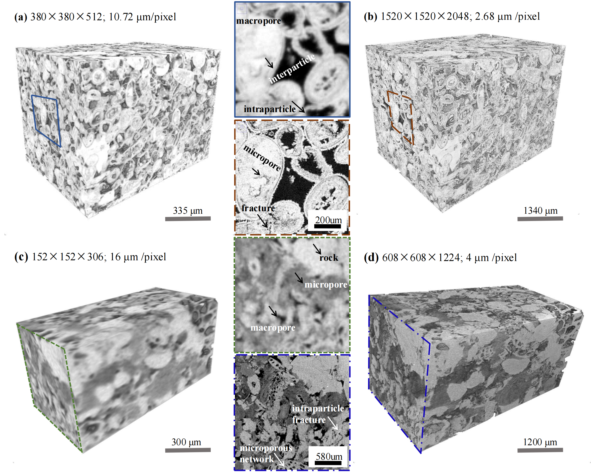
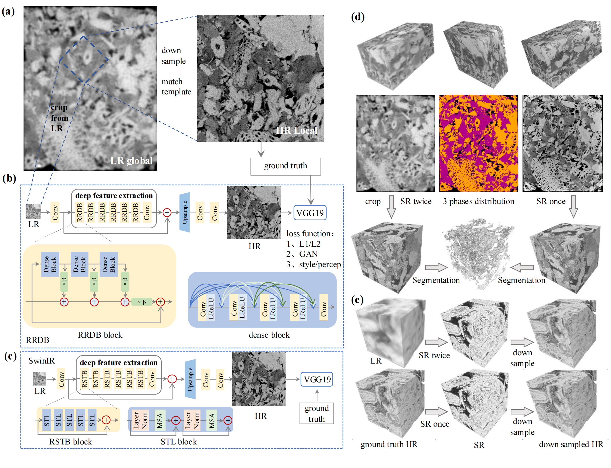
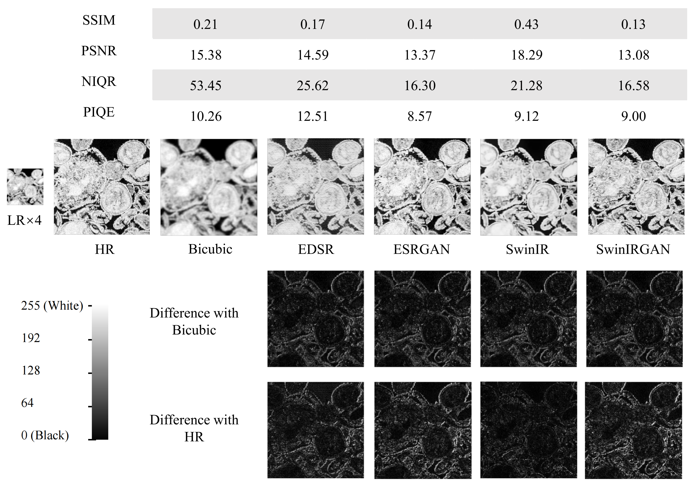
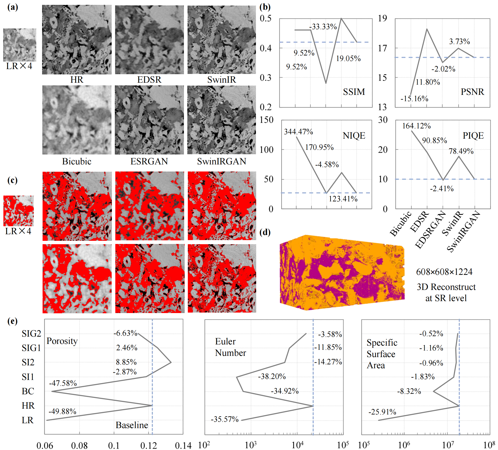
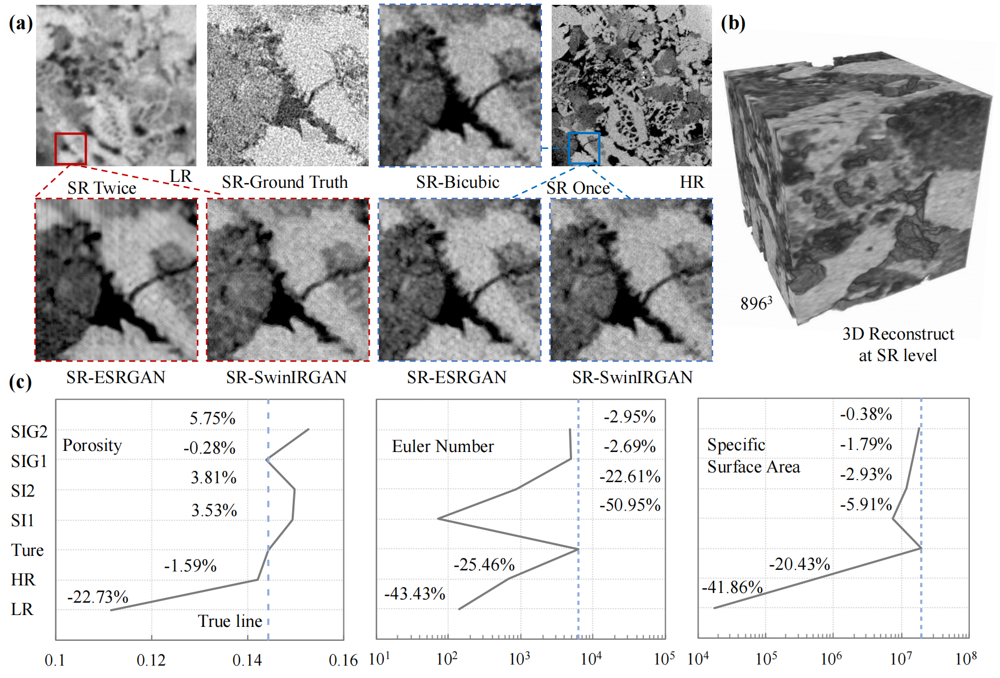
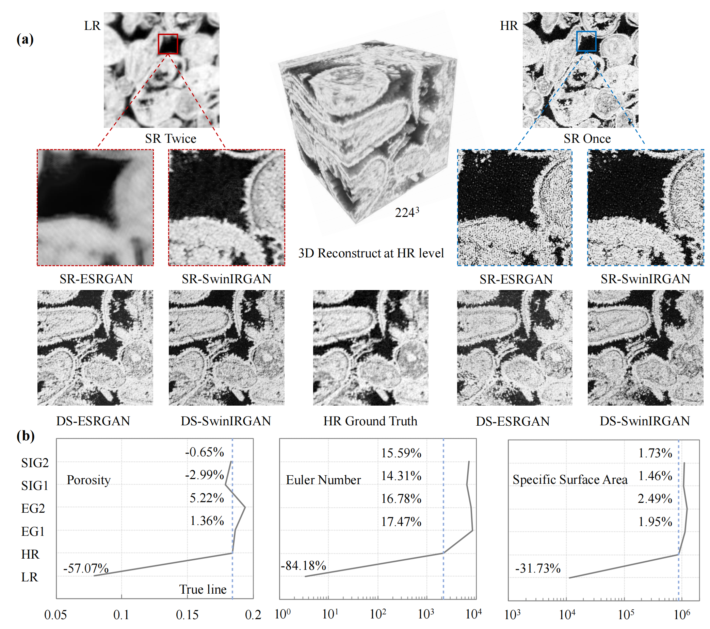

# PoreBoostGAN
## PART1

超分辨率技术旨在创建低分辨率和高分辨率图像之间的映射关系来实现通过低分辨率图像重构高分辨率图像，该技术具有非常广泛的应用前景。在地质学中不同分辨率下的岩石CT扫描出的结果表现出的特征差异非常大，低分辨率图像能够保存图像的低频信息（轮廓信息），高分辨率成像技术能够保存更多高频信息（细节）。高分辨率成像技术也没有解决所有问题，因为高分辨率成像需要镜头距离观察对象更近，这就限制了高分辨率成像只能在小视场上捕捉信息。超分辨率技术提供了一个非常巧妙的思路解决该问题，我们只需要训练低分辨率图像到高分辨率图像的映射关系，然后将低分辨率大视场的图像利用该模型映射，就能在当前技术下获取大视场高分辨率的图像了。这是当前任何仪器不能实现的功能，使用超分辨率技术就可以轻松实现。

为了验证假设的可行性，我们利用新南威尔士大学制备的碳酸盐岩数据集（MRCCM）和`BasicSR`来实现该技术。3D微米CT本质上就是非常多的2D图像在z轴上的堆叠，需要注意2D图像在XY平面上的分辨率需要和z轴的分辨率一致才具有物理意义（z轴的分辨率指每张2D图像之间的距离，2D灰度图可以保存为2D数组，每个数的取值范围为0-255，刚好int8格式能够高效存储，3D微米CT本质上就是3D数组，常保存为tiff格式）。通过图1的a,b子图的采样图可以看到低分辨率图像在其分辨率极限处会表现出模糊，模糊往往表现出灰色，因为0表示黑色，255表示白色，机器不知道某个位置究竟是黑色还是白色时就会赋给灰色（介于白色与黑色之间）。高分辨率图像在同一位置可以获取更多信息有多个点可以赋值，自然可以获得更高分辨率的图像，但是我们将高分辨率的图像进一步缩放到分辨率极限的时候同样的问题又会出现。物理上可以无限制的细分下去但是带有分辨率的图像上不可以，这就是分辨率和视场的矛盾。

接下来介绍3D超分辨率实验，刚刚介绍了3D图像的本质就是2D图像的堆叠，我们可以通过采样切割的方法3D数字岩心到2D图像实现监督学习所需要的配对数据集。值得注意的是我们在获取高分辨率2D图像的时候需要保证z轴跳过跨分辨率倍数的图像，比如，跨4倍分辨率时低分辨率正常切割图象，高分辨率图像需要每4张采样一次。准备好数据集就可以像图2的a,b,c所示的一样构建神经网络的映射了。虽然岩石本质上是三维的，更适合三维超分辨率，但我们选择二维方法是经过深思熟虑后的决策。这种方法在保持准确性的同时带来了显著的计算优势：计算复杂度从 $O(n^{3})$ 降低到 $O(n^{2})$，大大提高了处理效率；它可以处理更大的 XY 平面并更好地表征空间异质性，我们研究的问题就可以从微纳米尺度拓展到厘米或者分米的岩心尺度。由于基于卷积的神经网络具有空间不变性，因此我们可以再一次分割图像为更小的子图来训练模型，推理的时候由于batch size=1所以可以支持更大的图像作为输入。

在附录1中展示了MRCCM数据集在不同的模型上视觉数值指标和可视化上的对比。bicubic插值得到的结果虽然分辨率提升但是图像质量提升非常受限，对于灰度的数字岩心来说我们更倾向获得更趋近0（孔隙）或者255（基质）的图像，我们不期望得到模棱两可的结果（灰色）。由于该数据集比较简单，我们尝试了多种常见的深度学习的网络效果都非常好。通过该实验验证了我们提出的假设的可行性----通过低分辨率全局图像重构高分辨率全局图像。
## part2

背景介绍时我们提到了即使将高分辨率图像继续缩进到极限分辨率的时候也会出现模糊的结果，由于分辨率的限制CT无法判断某一个像素属于孔隙还是基质，于是给出了介于0到255之间的数值，导致了模棱两可的结果。这激发了我们想要进一步研究更高分辨率的图像的好奇心，我们联合了深圳大学利用当前microCT的极限分辨率1um/pixel，来扫描一个更优挑战性的数据集，为了研究跨两次分辨率的图像重构，我们扫描了3个分辨率分别是16，4，1um/pixel, 我们尝试训练16-4 um/pixel的映射模型，然后将4um/pixel的图像作为输入预测没有训练过的情况，往往机器学习模型在预测数据集中未出现的特征时性能往往会下降，但是对于孔隙介质来说，我们关心的孔隙度，迂曲度，欧拉数等拓扑相关的特征往往与分辨率直接相关，我们认为即使没有在数据集中出现过，但是训练16-4um/pixel的模型时机器学习模型会保存这些拓扑特征的映射关系，我们不关心图像的风格是否能和真实值对应的上，重点关注影响数字岩心的拓扑和物理层面的指标。数据集的可视化可以通过图1的cd看到16-4微米的图像映射关系更为复杂，不像MRCCM的非黑即白，即使高分辨率下也出现了大量灰色的部分。4um/pixel下仍然看不到具体的分类，我们认为这是碳酸盐岩独有的更为复杂的微纳米孔，通过microCT是无法看到更为细节的部分，这增加了模型收敛的难度。

超分辨率重构结果可以通过图3看到，本项研究中我们提出的新模型SwinIRGAN（我们将Swin Transformer和GAN结合提出的新模型）表现的非常好，能够适应更为复杂的情况，基于卷积的EDSR，ESRGAN不同程度的显现出了超分辨率模型收敛失败出现的伪影（周期性的出现的微小图案）。不仅仅在视觉和视觉指标上，我们研究的孔隙度，欧拉数，比表面积等参数基于SwinIR的模型可以更好的预测。SwinIR由于没有GAN loss的约束会出现一定程度的伪影，该实验配合MRCCM数据集的验证实验一起证明了GAN loss能够有效帮助重建高分辨率特征，抑制伪影。截至目前我们还在介绍当前已经存在的研究，即在配对数据集上训练以及预测。

我们现在已知了模型可以将图像分辨率放大为原来的4倍，为了验证模型在从未出现的数据上的预测效果，我们将4um/pixel的图像作为输入送入之前训练好的16-4um的模型来预测1um/pixel的图像。由于输出结果并没有出现在训练集中，视觉指标上任何模型都会非常的差，于是我们聚焦到拓扑相关的物理指标，孔隙度，欧拉数，比表面积上面。拓扑指标是随着分辨率变化而变化的，那么16-4um的模型从计算机视觉中学习到的潜在的拓扑属性变化规律或许可以迁移应用到准确预测1um/pixel的图像上面。结果如文章中的图4所示，我们提出的最强的模型SwinIRGAN可以很好的预测相关物理指标，且误差控制在了比较小的范围。

实际应用中，大多数情况下我们能采到最多一种分辨率下的图像，原位扫描同一个岩心两次是非常罕见的。于是我们利用MRCCM数据集设计了最后一个实验。我们有两个分辨率下原位扫描的实验结果，我们考虑到低分辨率3D图像超分两次，每次4倍的分辨率提升，数据体积将会膨胀到$4^3 \times 4^3$原来的4096倍，虽然跨尽可能多的尺度研究是我们想要的，但是跨太大会导致数字岩心一般的计算机内存很难加载。此外，我们认为即使准确预测了更高分辨率下的特征，也很难找到真实值来说服工程师实际应用的时候采纳我们模型的结果。于是我们采用了下采样策略处理没有真实值作为参考的最高分辨率下的图像，具体处理如下：基于配对数据集训练超分辨率模型，然后将低分辨率模型送给超分模型两次，就可以得到超出当前仪器分辨率的图像，然后将该图像进行下采样，得到和当前仪器能获得最高分辨率一致的图像，该图像与真实值的对比如图5所示。视觉上已经看不出什么差别了，物理指标上表现出来比较有意思的新发现，孔隙度的预测基本与真实值吻合，欧拉数在对数坐标系上比真实值大了约15%，实际大了大概一个数量级。比表面积也比真实值在对数坐标系上大了约2%。这个发现说明超分模型可以在保证分辨率不变的情况下将更多更高分辨率下才有的特征在下采样的时候保留下来，实际应用中可以通过该策略进一步提升图像质量，在不动用更高分辨率仪器的前提下。最后提一个简单的问题，我们大多数情况下只能获取一种分辨率下的图像，如何才能复刻刚刚描述的实验，制作监督学习所需要的配对数据集？ 

答案是我们使用当前仪器的极限分辨率扫描数据集一次即可，作为高分辨率的Ground Truth，低分辨率的图像通过下采样Ground Truth得到。
